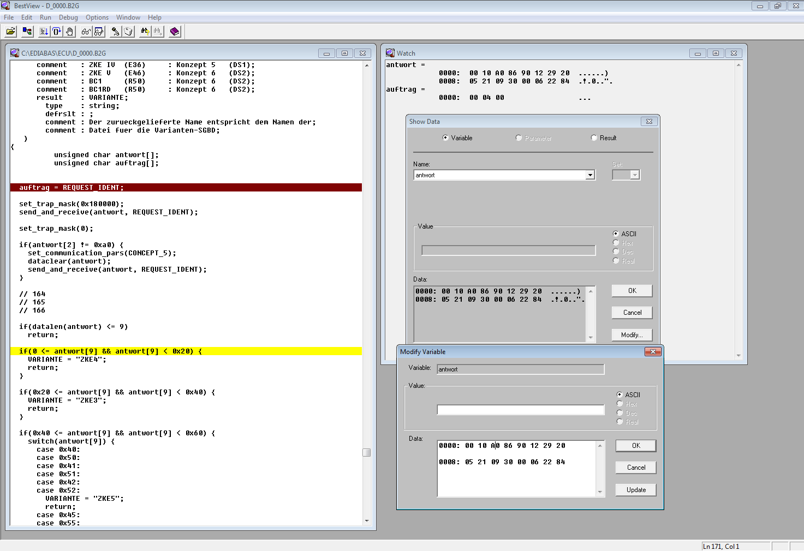

# ediabas-sgbd

## Overview

The source files are functionally equivalent to those used to create the BEST object files distributed with EDIABAS.

In order to recreate the source files, the BEST object file format, and the instruction set of the EDIABAS interpreter was reverse engineered.

As with any disassembly, or decompilation process, it's not always possible to perfectly reconstruct the original source code. In this case, the comments in the source file cannot be recovered as they are discarded during compilation.

Please note that these files are strictly a reference, and are not intended, nor suitable, for creating ECU description files (SGBDs).

## Group Files

Source File|BEST Object File|BIP Ver.|Rev. Number|Last Mod.
:-----|:-----|:-----|:-----|:-----
`D_0000.B2G`|`D_0000.GRP`|`05.05.00`|`1.25`|`Thu Jun 05 16:48:08 2003`
`D_003B.B2G`|`D_003B.GRP`|`05.05.00`|`1.7`|`Thu Apr 08 09:58:08 2004`
`D_0068.B2G`|`D_0068.GRP`|`05.05.00`|`1.27`|`Thu Feb 12 16:31:30 2004`
`D_007F.B2G`|`D_007F.GRP`|`05.05.00`|`1.20`|`Thu Apr 08 09:58:36 2004`
`D_00C8.B2G`|`D_00C8.GRP`|`05.05.00`|`1.40`|`Thu Feb 26 12:33:14 2004`
`D_00D0.B2G`|`D_00D0.GRP`|`05.05.00`|`1.51`|`Thu Feb 12 16:47:56 2004`
`D_00ED.B2G`|`D_00ED.GRP`|`05.05.00`|`1.14`|`Thu Feb 12 16:51:12 2004`
`D_ZKE_GM.B2G`|`D_ZKE_GM.GRP`|`05.05.00`|`1.04`|`Thu Jun 05 16:47:10 2003`

## Debugging with BestView

The BEST object files include debugging symbols to support debugging with BestView. 

> BestView is a Source Level Debugger for testing SGBD's written in BEST/2. With BestView you can run jobs line by line and view variables and analyse the job results during the run.

In order to make use of BestView, the source code has been reconstructed to match the target object file debugging symbols. This is essentially just using the same identifiers and data types, and making liberal use of whitespace to align the line numbers.

Assuming the target object file is available, simply open the source file in BestView, and debug away!

